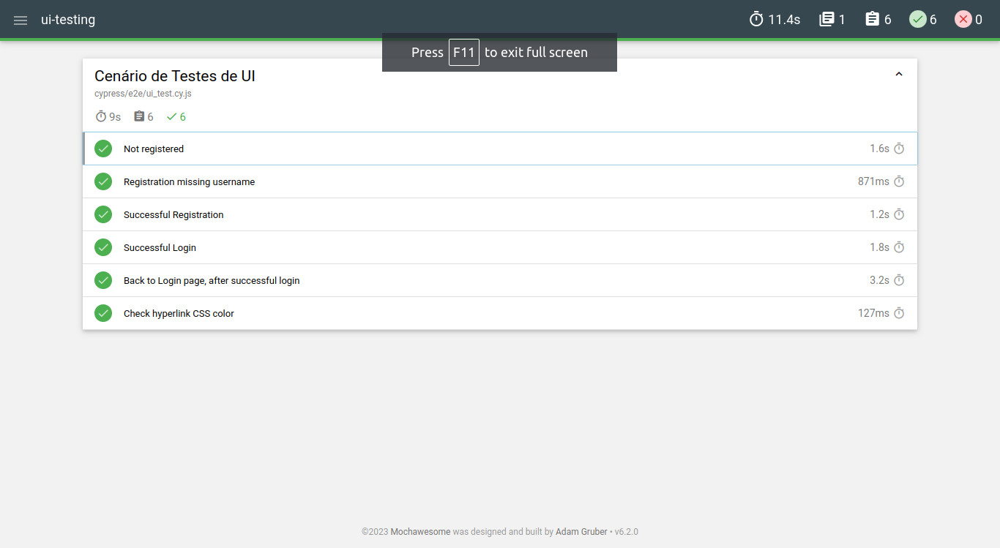

# UI Testing using Cypress



## Table of Contents
- [About](#about)
- [Setup](#setup)
- [Tests](#tests)
    - [Not Registered](#not-registered)
    - [Registration Missing Username](#registration-missing-username)
    - [Successful Registration](#successful-registration)
    - [Successful Login](#successful-login)
    - [Back to Login Page after Successful Login](#back-to-login-page-after-successful-login)
    - [Check Hyperlink CSS Color](#check-hyperlink-css-color)
- [Helper Functions](#helper-functions)
    - [Login User](#login-user)
    - [Generate String Function](#generate-string-function)

## About
This project is a Test Scenario for UI Testing using Cypress. The 6 tests were developed for the Quality Software discipline (S206). The tests includes unsuccessful logins, registration without a username, successful registration, successful login, returning to the login page after a successful login, and checking hyperlink CSS color.
The [target website](https://demo-login-pi.vercel.app/) is in the following repository: https://github.com/Isaquehg/login-page

## Setup
1. First, execute the following command, inside your desired folder, to start a Node project
```
    npm init
```
2. Then, install the Cypress requirements and Mochawesome (For HTML reports)
```
    npm install cypress --save-dev
    npm i --save-dev cypress-mochawesome-reporter
```
3. That's ready! Now run the Cypress:
```
    npx cypress open
```
4. Done the tests, you can generate the reports by closing the server, then running:
```
    npx cypress run --spec 'cypress/e2e/**/'
```

## Tests
For this project, 6 test cases were developed inside the Suite:

### Not Registered
Description: This test attempts to log in with invalid credentials and checks if the error message is displayed.

### Registration Missing Username
Description: This test attempts to register without providing a username and checks if the appropriate error message is displayed.

### Successful Registration
Description: This test registers a new user and verifies that the page title changes to "Login" after a successful registration.

### Successful Login
Description: This test registers a new user, logs in, and verifies that the login is successful.

### Back to Login Page after Successful Login
Description: This test registers a new user, logs in, and checks if the "Back to Login" button is visible on the page.

### Check Hyperlink CSS Color
Description: This test checks the CSS color of a hyperlink element and verifies that it matches the expected color #0077FF.

## Helper Functions
Here are the helper functions used to simplify the development

### Login User
Description: This function simulates a user login.

### Generate String Function
Description: This function generates a unique string based on the current time to create random data for registration.
